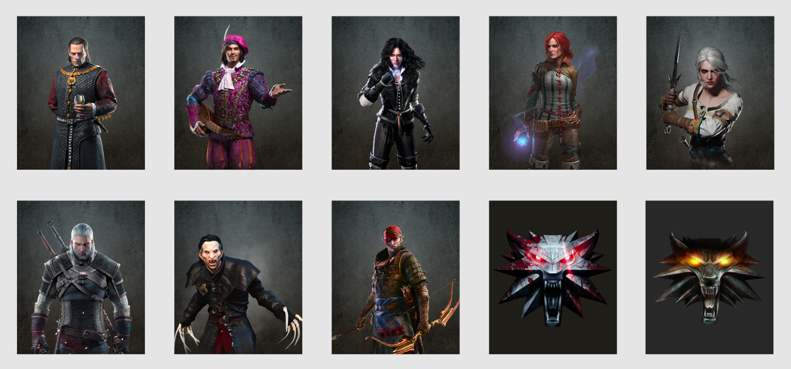
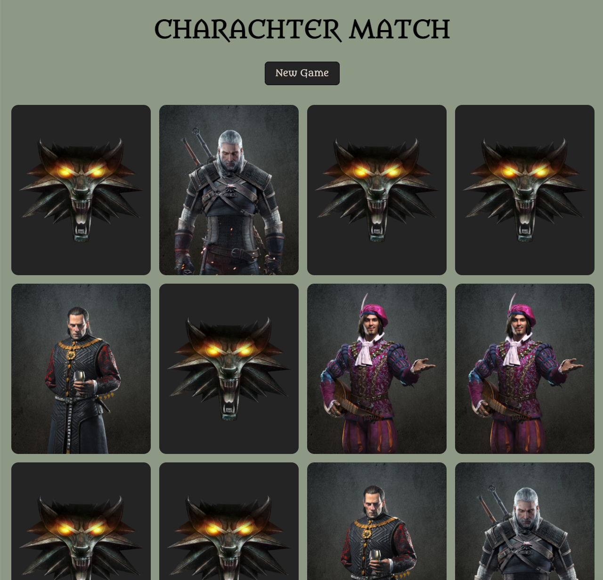

# Javascript/React - Memory Game

For this project I decided to create a memory game using react hooks(state/effect).\
Since I have been watching the Witcher series during the holidays I decided to make that my theme for this.\
I created the cards in Figma using a background image with texture and then .png images (without background) I found of characters and the medallion.\
I decided not to create an elaborate design for the finished project though, because of time, rather focus on the code.\

### [Link to Live Site](https://hebaulf.github.io/js-react/) 
### [The figma file with cards](https://www.figma.com/file/4CgYEbhL3pIVVN996kCxPy/Untitled?node-id=0%3A1)

 

 
 

## Getting Started with Create React App

This project was bootstrapped with [Create React App](https://github.com/facebook/create-react-app).  
 

### If you want to play around with the code

You can clone the repo:

#### `git clone https://github.com/hebaulf/js-react.git`  
 

Then install all dependencies:

#### `npm install`  
 

And at last run the app:

#### `npm run dev`

Runs the app in the development mode.\
Open [http://localhost:3000](http://localhost:3000) to view it in your browser.

The page will reload when you make changes.
